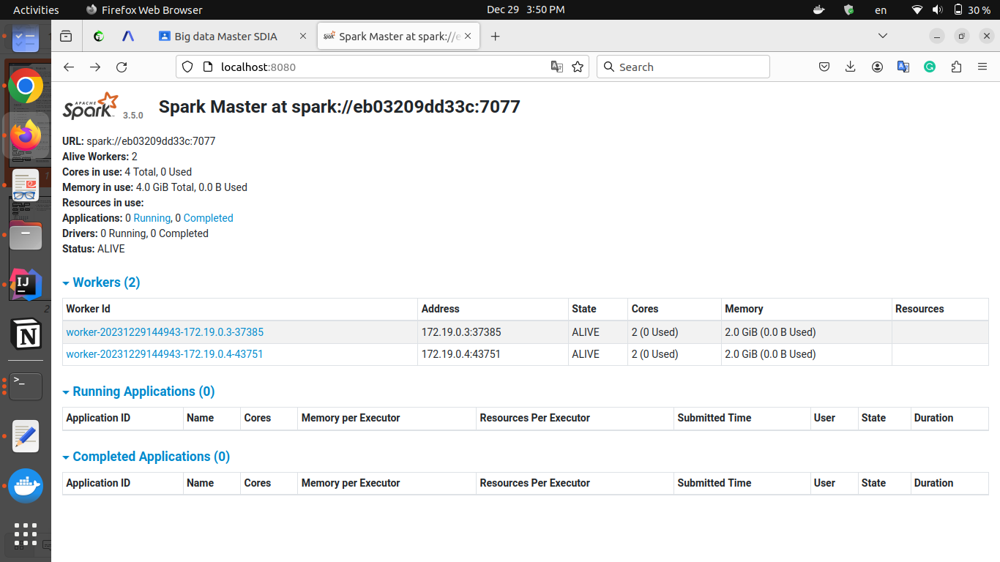

# Spark cluster using docker

Spark cluster using docker

## Getting Started

### Prerequisites

- docker and docker-compose
- Java 8 or later installed.

### Installation

1. Clone this repository:

    ```bash
    git clone https://github.com/MSARgd/spark-cluster-with-docker.git
    ```


## Screenshots





